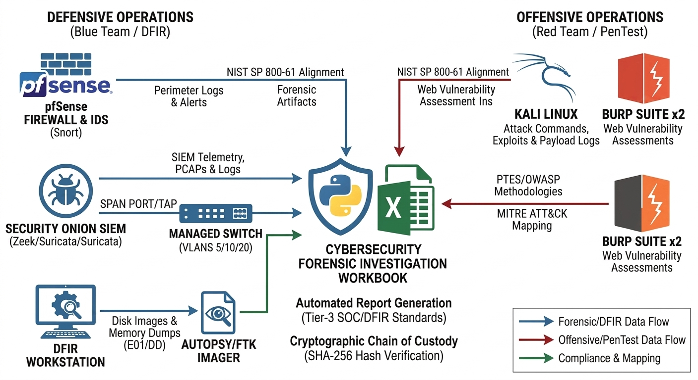

# Cybersecurity Purple Team Workbook
> An automated Python-driven reporting engine for generating Tier-3 SOC, DFIR, and Purple Team dossiers.

---

## Features & Capabilities

### 🛡️ Defensive Operations (Blue Team / DFIR)
* **NIST SP 800-61 Alignment:** Full integration of the Incident Response Lifecycle (Preparation through Recovery).
* **Cryptographic Chain of Custody:** Automated SHA-256 hashing fields for forensic integrity and non-repudiation.
* **Chronological Master Timeline:** Synchronized event logs tracking both "Event Time" and "Discovery Time."
* **SIEM Integration Ready:** Correlation-ready for **Security Onion** (Zeek/Suricata), **pfSense** (Snort), and Windows Event Logs.

### ⚔️ Offensive Operations (Red Team / PenTest)
* **Multi-Framework Mapping:** Standardized reporting for **PTES**, **OWASP Top 10**, and **OSSTMM**.
* **Adversary Emulation:** Direct mapping of custom exploits to **MITRE ATT&CK®** techniques.
* **Tactical Operations Journal:** High-fidelity tracking of terminal commands and raw tool outputs.

### 🛠️ Automation & Architecture
* **Engine:** Python-driven generation using `pandas` and `openpyxl`.
* **Gap Analysis:** Dynamic Pivot Matrix designed to compare tool performance and detection gaps.
* **Modular Design:** Easily extensible for new cybersecurity frameworks or lab tools.

---

## Workbook Structure
The generated `.xlsx` report contains specialized modules:
* 🔵 **Tactical Activity Log:** Blue Team command-and-control logging.
* 🟢 **PTES Matrix:** Network penetration testing milestones.
* 🟠 **OWASP Tracker:** Web application vulnerability mapping.
* 🔴 **NIST IR Lifecycle:** Incident response and forensic timeline.
* ⚫ **Evidence Vault:** SHA-256 hash verification and Chain of Custody.

---

## Technical Architecture


---

## Standard Operating Procedures (SOP)
Follow these steps to ensure forensic integrity and reporting accuracy.

### 1. Pre-Engagement Setup
- [ ] **Synchronize Clocks:** Ensure Kali, Security Onion, and pfSense are synced to the same NTP server.
- [ ] **Verify Dependencies:** Run `pip install -r requirements.txt`.

### 2. Data Collection (The Investigation Phase)
Capture the following data points during your lab work:
* **Defensive:** Alerts from Security Onion (Sguil/Squert) and logs from pfSense (Snort).
* **Offensive:** Exploit syntax from Kali and vulnerability paths from Burp Suite.
* **Forensics:** SHA-256 hashes of disk images/memory dumps from Autopsy/FTK Imager.

### 3. Executing the Generator
Run the script from your terminal:
```bash
python workbook_generator.py
